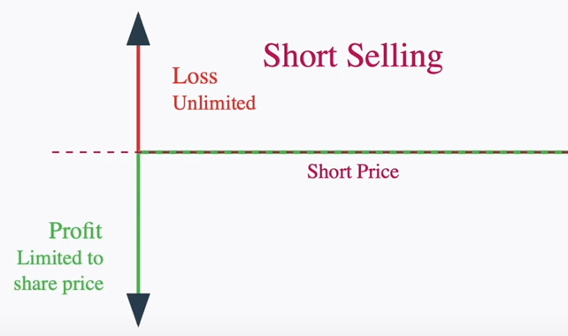
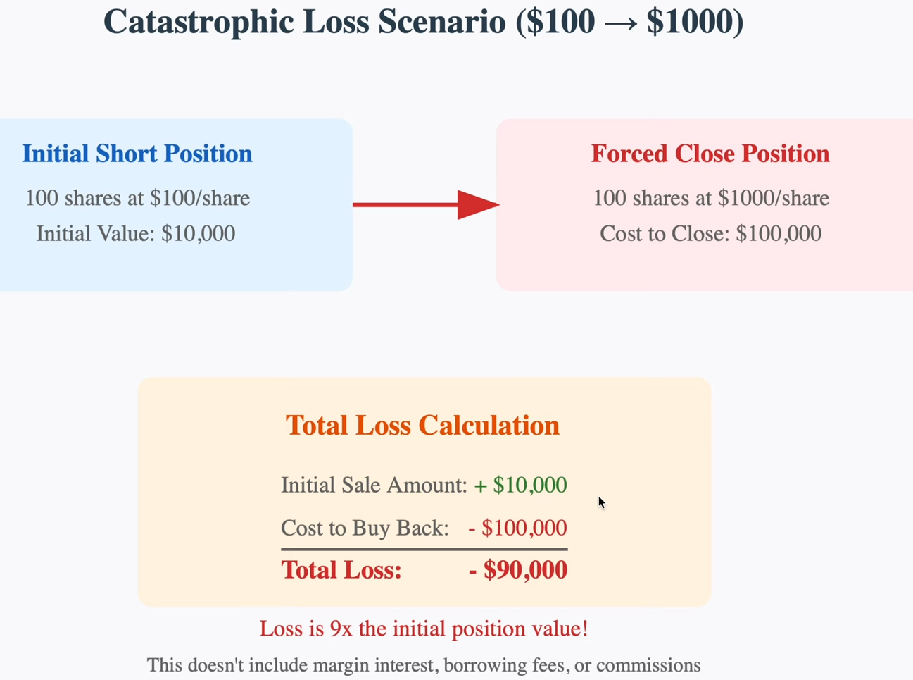

# BNP_BuildingPairTradingModel

## 📌 Business Case  
**Objective:** Build a Pair Trading Model to identify and exploit pricing dislocations between two correlated stocks.  

**Strategy:**  
- Long one stock and short the other based on **daily close prices**.  
- **Time horizon:** Medium to long term (1 week to 1 month).  

---

## ⚙️ Setup  

### Running on my Local Machine (Existing Virtual Environment)  
source .venv/bin/activate

python main.py

### Running on a New Machine (Fresh Setup)
sudo apt install python3-venv python3-full -y
python3 -m venv .venv
source .venv/bin/activate

pip install --upgrade pip

pip install yfinance

pip install matplotlib

pip install statsmodels

---

## 2/3. Data Collection and preprocessing
- **Source:** yfinance lib
- **Stocks to consider:**
    [
        "ASML.AS", "BESI.AS", "IFX.DE", "HSBA.L", 
        "INGA.AS", "ISP.MI", "ABI.BR", "RI.PA", 
        "BN.PA", "TSCO.L"
    ]

### Features added (thinking used)
- **RSI**

    RSI > 60 => a strong buy momentum is ongoing

    RSI < 40 => a strong sell momentum is ongoing

- **EMA**

    Price > EMA Long && Price > EMA Short => Price might be good for selling

    Price < EMA Long && Price < EMA Short => Price might be good for buying

    **EMA was choosen agains't SMA** because it reacts faster to current changes.

### ⚠️ Challenges & Solutions  

- **Challenges found in this phase:**  
  Missing daily close prices for some tickers → prevents normalized comparisons.  

- **Solution implemented:**  
  Forward-fill missing dates with the most recent available close price, creating a **continuous daily price series**.

### Fundamentals brief summary 2021-2024 
(taken from finance.yahoo website Financials Tab)
- **ASML.AS (2021–2024):**
  - **Net Income CAGR:**

    Approximately +6.5 % per annum
  - **Share Repurchases:**

    AVG of 35.295% and STD of 33.87%, of gross profit invested in NET repurchased programs (3.45, 7.08, 43.38, 87.27)
  - **Long-Term Debt:**

    2021: 0.77, 0.75.,  0.59, 2024: 0.61 (total debt/net income), pays off all its long term debt in a single operating year

- **BESI.AS (2021–2024):** 
  - **Net Income CAGR:**

    Approximately -14.1 % per annum
  - **Share Repurchases:**

    AVG of 30.32% and STD of 17.65%, of gross profit invested in NET repurchased programs (20.17, 56.77, 33.13, 11.21)
  - **Long-Term Debt:**
  
    2021: 1.11, 2022: 1.42, 2023: 1.80, 2024: 3.00 (total debt/net income), pays off all its long term debt in approximately 3 operating years in the worst scenario

- **IFX.DE (2021–2024):**
  - **Net Income CAGR:**

    Approximately +3.63 % per annum
  - **Share Repurchases:**

    AVG of 0.96% and STD of 1.66%, of gross profit invested in NET repurchased programs (3.84, 0.00, 0.00, 0.00)
  - **Long-Term Debt:**

    2021: 6.05, 2022: 2.81, 2023: 1.65, 2024: 4.06 (total debt/net income), pays off all its long term debt in approximately 6 operating years in the worst scenario

- **HSBA.L (2021–2024):**
  - **Net Income CAGR:**

    Approximately +21.80 % per annum
  - **Share Repurchases:**

    AVG of 12.88% and STD of 4.79%, of gross profit invested in NET repurchased programs (22.73, 16.19, 8.63, 4.95)
  - **Long-Term Debt:**

    2021: 17.73, 2022: 14.24, 2023: 10.48, 2024: 10.58 (total debt/net income), pays off all its long term debt in approximately 22 operating years in the worst scenario.

- **INGA.AS (2021–2024):** Excluded due Long-Term Debt exposure
  - **Net Income CAGR:**

    Approximately +10.16 % per annum
  - **Share Repurchases:**
  
    0.00% and STD of 0.00%, of revenue invested in NET repurchased programs (0.00, 0.00, 0.00, 0.00)
  - **Long-Term Debt:**

    2021: 24.30, 2022: 32.53, 2023: 20.58, 2024: 26.80 (total debt/net income), pays off all its long term debt in not less than 20 years in the worst scenario

- **ISP.MI (2021–2024):**
  - **Net Income CAGR:**

    Approximately +28.0 % per annum
  - **Share Repurchases:**

    AVG of 2.42% and STD of 0.93%, of gross profit invested in NET repurchased programs (1.71, 2.35, 3.20, 2.42)
  - **Long-Term Debt:**

    2021: 24.17, 2022: 15.76, 2023: 18.39, 2024: 16.07 (total debt/net income), pays off all its long term debt in not less than 15 years in the worst scenario

- **ABI.BR (2021–2024):**
  - **Net Income CAGR:**

    Approximately +7.9 % per annum
  - **Share Repurchases:**

    AVG of 5.74% and STD of 5.39%, of gross profit invested in NET repurchased programs (0, 0, 1.15, 9.46)
  - **Long-Term Debt:**

    2021: 12.29, 11.53, 13.36, 2024: 10.15 (total debt/net income), requires over 10 operating years to pay off in the worst scenario

- **RI.PA (2021–2024):**
  - **Net Income CAGR:**
    
    Approximately +4.2% per annum
  - **Share Repurchases:**
    
    AVG of 4.57% and STD of 2.45%, of gross profit invested in NET repurchased programs (0.00, 5.18, 6.65, 6.45)
  - **Long-Term Debt:**
    
    2021: 7.35, 2022: 5.60, 2023: 5.24, 2024: 9.22 (total debt/net income), pays its debt in 9 years inn the worst case scenario

- **BN.PA (2021–2024):**
  - **Net Income CAGR:**
  
    Approximately -8.6% per annum
  - **Share Repurchases:**
  
    AVG of 1.53% and STD of 3.05%, of gross profit invested in NET repurchased programs (7.09, 0, 0, -2.57)
  - **Long-Term Debt:**
  
    2021: 8.54, 7.46, 6.03, 2024: 4.04 (total debt/net income), pays its debt in 9 years in the worst case scenario

- **TSCO.L (2022–2025):**
  - **Net Income CAGR:**

    Approximately –6.9 % per annum
  - **Share Repurchases:**

    AVG of 8.15 % and STD of 4.04 %, of gross profit invested in net repurchase programs (8.94, 6.46, 8.69, 8.52)
  - **Long-Term Debt:**

    2022: 15.36, 15.08, 14.84, 2025: 14.67 (total debt/net income), requiring approximately 9 years of current net income to pay off all long-term debt in the worst-case scenario

**Why did I use these 3 indicators and not other ones?**
1. Net Income growth analysis and Share Repurchases influence highly the potencial price of share, respectively, because:
    - If the net income increases, naturally the price of the shares also increase if the they are not overvalued
    - If a company repurchases stocks it reduces their supply to the market. Therefore if the demand remains steady or increases the stock naturally will increase on price

2. Long-Term debt
    - The first, second, and third rule in investing is to never lose money.
    - We must remain mindful of macroeconomic scenarios that could push businesses toward bankruptcy. 
    - Bankruptcy often stems from a company’s inability to service its debt. If a company can repay its debt using its net earnings within 2-4 years (there's no fixed number here, but it should be a small number ofc), that is generally a reasonable timeframe, as it allows them to better navigate periods of macroeconomic uncertainty.

  **Note:**
  We could and should do a lot more analysis in the missing fundamental variables but I guess **this already shows up some analytical skills given Fundamental Analysis** which is not asked in the assessment but if I could choose I'd partially integrate it in the work as it has analytical value.

## 4. Statistical Analysis
- Measures used:
    1. Engle–Granger cointegration p-value:

        In pairs trading, we want pairs that move together in the long run so that their spread is mean-reverting. Therefore we want this value to be the lowest possible to reject no cointegration.

    2.  Alpha e Beta:
        
        Beta:
        Example of each:
        If Beta = 1.5 => historically, when P_b moves 1€, P_a moves 1.50€ in the same direction.
        It also tells us how much more volatile the stock is.

        Alpha:
        Alpha => average offset when the P_a = P_b * Beta

### ⚠️ Challenges & Solutions  

- **Challenges found in this phase:** 

1. THe pair trading aims to do Heding acheiving a kind of "market neutral" status. If the Beta is not considered to be stable it's useless because might still be exposed to market direction or sector trends.

2. Strangely I was expecting to get a stocks from the same industry correlated... But instead the pair of stocks which scored the biggest value were ASML which is from the Semiconductors industry and Danone (Package Foods).
- **Solution implemented:**  
  I've built 2 models with different enterprises. T

1. The rationale was: Although I have got the beta unstable...
  Let's follow the assessment request and give a trial with the stocks which correlated the best P_value = 0.031822.
  After finetunning the model with EMA + RSI it gave:

    2024-01-04 | BUY           ASML.AS at 636.15

    2024-01-04 | SELL SHORT    BN.PA at 56.80

    With a return 47% as of 2025-01-01(excluding taxes and transaction costs).

2. The second trial which I though we should give a trial were for 2 companies which happened of being the same sector + had the best fundamental to avoid us loosing all our money which is: goind bankrupt, because both were able to pay all it's debt in equal or less than 3 years.

    The companies were: ASML.AS and BESI.AS and the analysis are above in the **Fundamentals brief summary 2021-2024** part.

    The results were:

    2024-01-04 | BUY           ASML.AS at 636.15

    2024-01-04 | BUY           BESI.AS at 122.3

    With a return 65% as of 2025-01-01(excluding taxes and transaction costs).

## 5. Trading Strategy
### Risk Management
#### Risk Management
- Entry Signal:

    1. Long

        Asumming the 3 companies have stable financials although solely 1 showed to be strong in strong in earnings (ASML.SA vs BESI.SA and BN.PA), we have used 2 EMA curves. One to analyse monthly stock behavior and other to analyse weekly stock behavior.

        Given the first phrase we assumed that we solely assumed **potencial entry points** in a stock once it's Price < EMA_short AND Price < EMA_long.

        They would be **effective entry points** if the RSI would detect an oversold condition of those stocks bellow 30 within the last 40 days.

    2. Short

        Criteria: price > EMA_long AND price > EMA_short AND short_entry_rsi > 50

        Would consider the stock as overbought and would short it. 

- Exit Signal:
    1. Long

        price > EMA_long AND price > EMA_shor AND RSI > long_exit_rsi

        As long as we ensure that the entering momment was in a completely oversold condition we can be convicted of dropping it only once we detect and overbought condition. If the fundamentals are kept strong it also gives some insurances to our investors (given the companies selected in the second scenario).

        2. Short 

        price < EMA_long AND price < EMA_short AND RSI < short_exit_rsi=40
        
        My plan in shortting it's short term. If in the entry signals it already detects the stock weakening, we want to make some money by just letting a few weaker and solding after.

**NOTE**
Dangers of shorting:
1. It potentially and theoretically may bring infinite losses.
2. THe gains are theoretically limited to the price of the stock.

  
   
  <em>Figure 1 – Short behavior function</em>

  
   
  <em>Figure 2 – Shorting example</em>

2. How much would you invest in each pair?

In the first scenario: the one we needed to choose 1 pair from the combination of the 10 stocks, I'd use the Hedge Ratio.

If I had 10 000€ to invest (purely in stocks, assuming we have already optimized the missing money in Treasury Bonds thorugh the Markovitz optimzed curve) and assuming a Beta calculated in the statistics of 1.5 (when B moves 1€, A moves 1.5€ in the same direction), I'd go:

Long to A for instance instance with 4000€.

Given the beta value B=1.5 * 4000€ = 6000€, having the total 10000€ invested, I'd invest 6000€ in the stock B. 

**Explanation:**

We do this to avoid overexposing ourselves to a sole stock, therefore we invest accordint to the Beta Value multiplication over the second stock from the pair given the volatility of both not being the same.

In the second scenario: As we are just allowed to select a pair from the 10 stocks I'd expose my-self 50-50. Altough we could also consider other methods such as Markovitz **(although prices from the past do not ensure repetition of behaviors in the feature)**.

### ⚠️ Challenges & Solutions  

- **Challenges found in this phase:** 

1. It was my first time considering shorting scenarios. I'd be more confident if we could have a bit of more Technical and Fundamental Indicators, but as it's an assessment with limited time doesn't gives me the time enough to structure how to work with each indicator. 

- **Solution implemented:**  
1. Although I did not worked with lots of indicators I tried to show proficiency in alligning the ones I used together and show off a sound strategy.

## 5. Backtesting
### Simulation

Implemented in the "build_strategy" function under main.py

### Metrics
p_value      alpha      beta    beta_cv  half_life  cointegration_ok  beta_stable  hl_ok
1. p_value => Stocks which correlated the best have a smaller P_Value < 1 
2. alpha => average offset when the P_a = P_b * Beta
3. half_life => how many periods it takes for a deviation from the mean to shrink in a mean-reverting process
4. cointegration_ok => If 2 stocks behave the same way
5. beta_stable => If it's stable it is considered to bring "market neutral" status
6. hl_ok => If it's ok, usually the "half_life" description happens
7. net return

