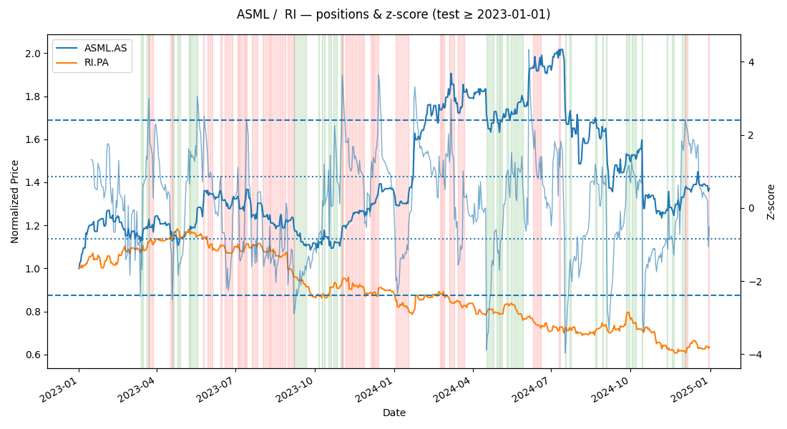

# BNP_BuildingPairTradingModel

Mean-reversion **pairs trading** in equities with a clean OOP layout, **cointegration-based** pair selection, a **z-score spread** strategy, realistic **transaction costs**, and **stop-based** risk controls. Includes simple grid/greedy parameter tuning.

---

## TL;DR (current features)

- **Pair selection:** Engle–Granger cointegration, OLS hedge ratio (β), half-life, β-stability; rank candidates.
- **Strategy (current):** **Z-score** entry/exit.
- **Risk:** **stop-loss**, **take-profit**, optional **time stop**, **transaction costs** (default **5 bps per leg**).
- **Backtest stats:** daily & annual **Sharpe**, **max drawdown**, closed-trade win rate, avg/std trade return, top 3 wins/losses.

---

## Results (example run)

**Top-ranked pairs (train period):**
| pair          | n_obs | p_value       | alpha     | beta    | beta_cv | half_life | cointegration_ok | beta_stable | hl_ok | score |
|---------------|-------|---------------|-----------|---------|---------|-----------|------------------|-------------|-------|-------|
| ASML.AS/RI.PA | 1096  | 6.047576e-12  | -3.987571 | 2.008979| 1.453706| 8.392971  | True             | False       | True  | 2     |
| ASML.AS/BESI.AS | 1096| 2.561226e-09  | 2.286047  | 0.988719| 0.508977| 12.366520 | True             | False       | True  | 2     |
| BESI.AS/IFX.DE | 1096 | 4.356609e-08  | 0.159831  | 1.118406| 0.604092| 13.602749 | True             | False       | True  | 2     |
| ISP.MI/RI.PA   | 1096 | 1.997146e-02  | -4.479026 | 0.967904| 1.599146| 6.341913  | True             | False       | True  | 2     |
| INGA.AS/RI.PA  | 1096 | 4.263373e-02  | -7.076180 | 1.799475| 1.689437| 7.033190  | True             | False       | True  | 2     |

**Selected top pair (trained on < 2023-01-01):** `ASML.AS / RI.PA`

**Top 10 combos (After applying the greedy search algo, optimized through penalizing the sharpe, i.e. ):**
| entry_z | exit_z | stop_loss_pct | take_profit_pct | z_window | use_rolling_z |  sharpe  | total_return_% | max_drawdown_% | number_of_position_changes |   score  |
|---------|--------|---------------|-----------------|----------|---------------|----------|----------------|----------------|--------|----------|
| 1.5     | 0.3    | 0.0           | 0.10            | 30       | True          | 0.187699 | 419.755219     | 14.040572      | 99     | 0.187699 |
| 1.5     | 0.3    | 0.0           | 0.25            | 30       | True          | 0.184252 | 635.665250     | 15.481990      | 99     | 0.184252 |
| 1.5     | 0.3    | 0.0           | 0.30            | 30       | True          | 0.184252 | 635.665250     | 15.481990      | 99     | 0.184252 |
| 1.5     | 0.3    | 0.0           | 0.35            | 30       | True          | 0.184252 | 635.665250     | 15.481990      | 99     | 0.184252 |
| 1.5     | 0.3    | 0.0           | 0.40            | 30       | True          | 0.184252 | 635.665250     | 15.481990      | 99     | 0.184252 |
| 1.5     | 0.3    | 0.0           | 0.45            | 30       | True          | 0.184252 | 635.665250     | 15.481990      | 99     | 0.184252 |
| 1.5     | 0.3    | 0.0           | 0.50            | 30       | True          | 0.184252 | 635.665250     | 15.481990      | 99     | 0.184252 |
| 1.5     | 0.3    | 0.0           | 0.15            | 30       | True          | 0.181455 | 498.182972     | 18.253797      | 99     | 0.181455 |
| 1.5     | 0.3    | 0.0           | 0.20            | 30       | True          | 0.180825 | 601.153321     | 15.659052      | 101    | 0.180825 |
| 2.9     | 0.9    | 0.0           | 0.50            | 30       | True          | 0.178701 | 599.536235     |  8.713860      | 58     | 0.178701 |

**Backtest summary (2023-01-01 to 2025-01-01):**

With:

| Parameter       | Value |
|-----------------|-------|
| entry_z         | 2.4   |
| exit_z          | 0.85  |
| stop_loss_pct   | 0.05  |
| take_profit_pct | 0.45  |

Results:

| Metric                | Value      |
|------------------------|------------|
| n_days                | 730        |
| beta                  | -2.460     |
| final_equity          | 3.455      |
| total_return_%        | 245.54     |
| avg_daily_return      | 0.001886   |
| vol_daily_return      | 0.019642   |
| sharpe_daily          | 0.0960     |
| sharpe_annual         | 1.524      |
| max_drawdown_%        | 25.36      |
| trades                | 124        |
| n_trades              | 57         |
| positive_trades       | 33         |
| positive_trade_rate   | 0.579      |
| avg_trade_return_%    | 2.476      |
| std_trade_return_%    | 6.088      |
| open_position         | 0          |
| stops                 | {'stop_loss_pct': 0.05, 'take_profit_pct': 0.45, 'max_bars_in_trade': None} |

  

**Top trades (net, incl. costs)**
Top Winners
| start      | end        | days | side                           | net_return_% |
|------------|------------|------|--------------------------------|--------------|
| 2023-08-31 | 2023-09-21 | 22   | SHORT ASML.AS / LONG RI.PA     | 57.110033    |
| 2023-10-31 | 2023-11-03 | 4    | LONG ASML.AS / SHORT RI.PA     | 19.899154    |
| 2024-01-03 | 2024-01-18 | 16   | SHORT ASML.AS / LONG RI.PA     | 17.582784    |

Top Losers
| start      | end        | days | side                           | net_return_% |
|------------|------------|------|--------------------------------|--------------|
| 2024-10-14 | 2024-10-15 | 2    | LONG ASML.AS / SHORT RI.PA     | -16.614841   |
| 2023-12-08 | 2023-12-14 | 7    | SHORT ASML.AS / LONG RI.PA     | -13.703934   |
| 2024-05-23 | 2024-05-29 | 7    | LONG ASML.AS / SHORT RI.PA     | -10.465058   |

> **Note on β sign/magnitude:** Train vs. test can yield different β (e.g., 2.01 vs. −2.46) depending on window and regression direction. The logic uses \(s_t = A - βB\) consistently; long/short mapping adjusts automatically.

---

## Strategy in 60 seconds

1. **Hedge ratio (β):** OLS of A on B.  
2. **Spread:** `s_t = A_t - β B_t`  
3. **Z-score:** `z_t = (s_t - μ)/σ` (rolling or full-sample).  
4. **Enter:**  
   - `z ≥ +entry_z` ⇒ **short A / long B**  
   - `z ≤ -entry_z` ⇒ **long A / short B**  
5. **Exit:** when `|z| ≤ exit_z` (**hysteresis** to reduce whipsaw).  
6. **Risk:** per-trade **stop-loss**, **take-profit**, optional **time stop**.  
7. **PnL:** `pos × (r_A - β r_B) - costs`. Each position change costs **2 legs**; a flip costs **4**. Default **5 bps/leg**.

**Why it can work:** Cointegration suggests long-run linkage with **mean reversion**. Half-lives in **single-digit weeks** fit the horizon. Hysteresis cuts noise; costs/stops keep it realistic.

## Project layout
<pre>
BNP_BuildingPairTradingModel/
├─ analysis/                      # pair selection & stats (cointegration, ranking, tuning)
├─ data/                          # local cache (prices/meta) → ignored in git
│  └─ market/
├─ delivery_one_backup/           # snapshot of previous assessment re-worked
├─ images/                        # saved plots
├─ indicators/                    # previous technical indicators
│  ├─ ema.py
│  └─ rsi.py
├─ models/
│  ├─ hedge.py                    # hedging
│  └─ stats.py                    # auxiliary functions
├─ strategies/                    # strategy interfaces & implementations
│  ├─ base.py                     # abstract Strategy
│  ├─ ema_rsi.py                  # EMA/RSI cross (separate from pairs)
│  └─ zscore_only.py              # z-score pairs strategy (current)
├─ utils/                         # helpers for I/O, plotting, reporting
│  ├─ helpers.py
│  ├─ io.py
│  ├─ plotting.py
│  └─ report.py
├─ DataStructures.py              # Enterprise + TimePeriod + yfinance caching
├─ main.py                        # wiring: load → rank → tune → backtest → report
└─ README.md
</pre>
